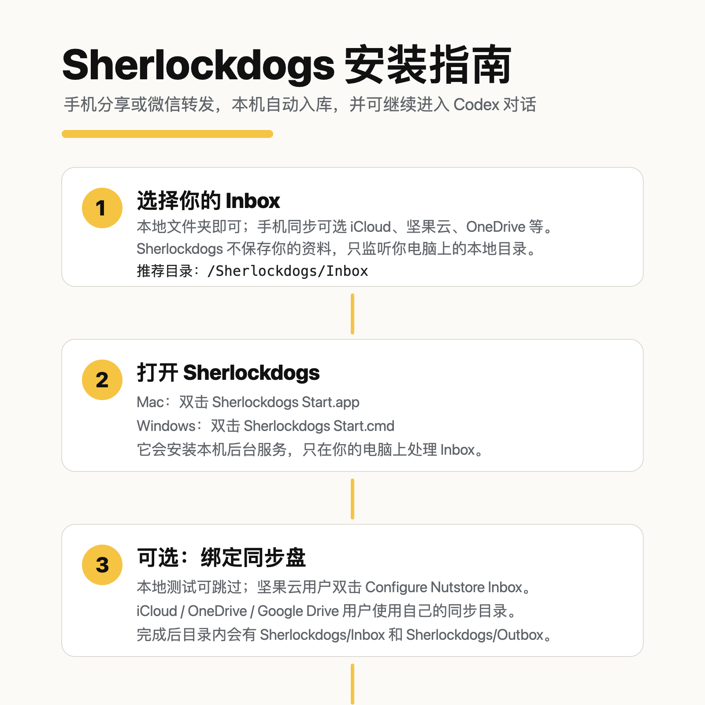

# Sherlockdogs

Local-first clipping for people who live between phone, Markdown, Obsidian, and Codex.

Sherlockdogs turns links, text, images, and local files from your phone or desktop into a private Markdown archive, then optionally hands selected items to Codex as ready-to-work tasks.

## Public Beta

Status: `READY_FOR_PUBLIC_BETA`

| Platform | Start Here |
|---|---|
| macOS | [Download the macOS beta folder](releases/1.0-public-beta/macos/Sherlockdogs-macos-alpha-1.0.0-alpha.3/) |
| Windows | [Download the Windows beta folder](releases/1.0-public-beta/windows/Sherlockdogs-windows-alpha-1.0.0-alpha.2/) |

Open the whole platform folder, then read `START_HERE.md`.

| macOS | Windows |
|---|---|
|  |  |

## Three-Step Flow

```text
1. Start Sherlockdogs
2. Send content to your Sherlockdogs Inbox
3. Open the local Markdown output
```

| Platform | Start | Open Output | Diagnose |
|---|---|---|---|
| macOS | `Sherlockdogs Start.app` | `Sherlockdogs Open Output.app` | `Sherlockdogs Doctor.app` |
| Windows | `Sherlockdogs Start.cmd` | `Open Sherlockdogs Output.cmd` | `Doctor Sherlockdogs.cmd` |

## What It Does

- Accepts links, text, images, and media references from a local or synced Inbox.
- Writes auditable Markdown artifacts into your chosen local vault.
- Creates Codex cards for items marked with `#` or `#2`.
- Keeps user content local by default.
- Works with Obsidian, but does not require Obsidian.

## Command Levels

| Command | Behavior |
|---|---|
| no tag or `#1` | Save locally only |
| `#` or `#2` | Save locally and create a Codex card |
| `#3` | Prepare lightweight metadata/transcript analysis |
| `#4` or `#ob` | Prepare deep reading / distillation |
| `#5` | Prepare heavier media breakdown tasks |

## Beta Notes

- Use the whole macOS or Windows folder as-is. Do not copy only the top-level launcher.
- No zip, dmg, tar, or installer package is published for this beta.
- macOS may require right-click -> Open on the first launch.
- First launch may spend a few minutes installing Python dependencies.
- Mac WeChat Personal Mode is optional. The stable beta entry is local or synced Inbox.

## Privacy

Sherlockdogs is designed for local-first workflows:

- No hosted inbox is required.
- No third-party bot account is required for the default path.
- Raw archives stay in your local vault.
- Credentials, cookies, and private app databases are excluded from this repository.

## Developer Quickstart

```bash
git clone https://github.com/SherlockRobo/sherlockdogs.git
cd sherlockdogs
python3 -m venv .venv
source .venv/bin/activate
pip install -e .
sdogs ingest "https://example.com/article #2" --vault ./demo-vault
```

Output:

```text
demo-vault/clipping/web/<slug>/raw.md
demo-vault/clipping/web/<slug>/metadata.json
demo-vault/jobs/pending/<job-id>.json
```
