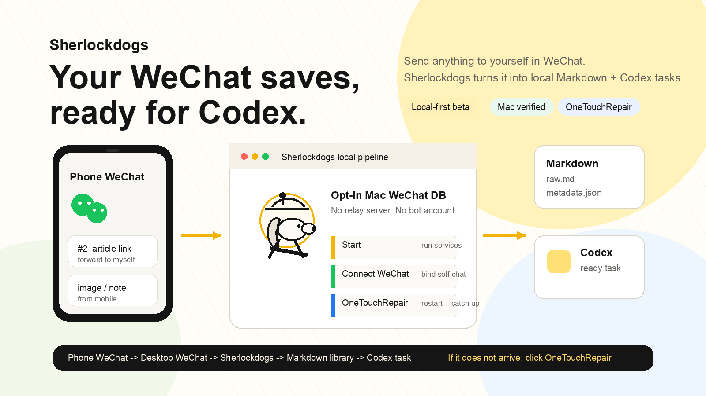

<p align="center">
  
</p>

<h1 align="center">Sherlockdogs</h1>

<p align="center">
  Send anything to yourself in WeChat. Sherlockdogs turns it into local Markdown and Codex-ready tasks.
</p>

<p align="center">
  <a href="releases/1.0-public-beta/">Download public beta</a>
  ·
  <a href="releases/1.0-public-beta/macos/Sherlockdogs-macos-alpha-1.0.0-alpha.3/START_HERE.md">macOS quick start</a>
  ·
  <a href="releases/1.0-public-beta/windows/Sherlockdogs-windows-alpha-1.0.0-alpha.2/START_HERE.md">Windows quick start</a>
  ·
  <a href="docs/architecture.md">Architecture</a>
</p>

## What It Does

Sherlockdogs is a local-first clipping pipeline for people who save ideas on a phone, but actually work in Markdown, Obsidian, and Codex on a desktop.

```text
Phone WeChat -> Desktop WeChat -> Local WeChat DB -> Markdown library -> Codex task
```

No relay server. No bot account. No hosted inbox. The beta is built around your own desktop WeChat receiving messages you forwarded to yourself.

## Public Beta

| Platform | Best for | Current status |
|---|---|---|
| macOS | First beta users | Real self-chat -> local WeChat DB -> Markdown/Codex smoke passed |
| Windows | Windows beta testers | Same product path is packaged; diagnostics export included |
| iOS Shortcut / Inbox | Fallback only | Use when local WeChat DB access is not usable |

| Download | Link |
|---|---|
| Public beta folder | [releases/1.0-public-beta](releases/1.0-public-beta/) |
| macOS alpha.3 | [Sherlockdogs-macos-alpha-1.0.0-alpha.3](releases/1.0-public-beta/macos/Sherlockdogs-macos-alpha-1.0.0-alpha.3/) |
| Windows alpha.2 | [Sherlockdogs-windows-alpha-1.0.0-alpha.2](releases/1.0-public-beta/windows/Sherlockdogs-windows-alpha-1.0.0-alpha.2/) |

No zip, dmg, tar, or installer archive is published for this beta. Download the platform folder as-is.

## Quick Start


1. Download the whole beta folder for your platform.
2. Read `START_HERE.md` inside that folder.
3. Start Sherlockdogs.
4. Forward an item to yourself in WeChat.
5. Open the generated Markdown output.

| Platform | Start | Connect / test | Output | Diagnostics |
|---|---|---|---|---|
| macOS | `Sherlockdogs Start.app` | `Sherlockdogs Connect WeChat.app` | `Sherlockdogs Open Output.app` | `Sherlockdogs Doctor.app` |
| Windows | `Sherlockdogs Start.cmd` | `Sherlockdogs Connect WeChat.cmd` or `Run Windows WeChat Smoke.cmd` | `Open Sherlockdogs Output.cmd` | `Doctor Sherlockdogs.cmd` |

First launch may spend a few minutes installing Python dependencies. macOS may require right-click -> Open on the first launch.

If a new WeChat item does not arrive on macOS, click `Sherlockdogs OneTouchRepair.app`. It restarts the local services, re-enables the background job, and catches up missed self-chat items.

## Features

Status: `READY_FOR_PUBLIC_BETA`

| Feature | Status | Notes |
|---|---|---|
| WeChat self-chat capture | Beta | User forwards to self; desktop WeChat receives locally |
| Local WeChat DB adapter | Beta | Opt-in local adapter; no hosted relay |
| Markdown archive | Ready | Writes `raw.md`, metadata, and result folders |
| Codex handoff | Ready | `#` / `#2` can create Codex-ready tasks |
| Obsidian reading | Ready | Uses plain files; Obsidian is optional |
| iOS Shortcut / Inbox fallback | Fallback | For machines where DB access is not usable |
| Windows evidence export | Ready | Helps debug real Windows machine failures |

## Command Levels

| Command | Behavior |
|---|---|
| no tag or `#1` | Save locally only |
| `#` or `#2` | Save locally and create a Codex card |
| `#3` | Prepare lightweight metadata / transcript analysis |
| `#4` or `#ob` | Prepare deep-reading / distillation |
| `#5` | Prepare heavier media-breakdown tasks |

## Known Limits

- This is a public beta, not an app-store-style installer.
- The main path depends on the desktop WeChat local DB being discoverable and readable after opt-in setup.
- macOS has passed real self-chat DB smoke on the current test machine.
- Windows is packaged for the same product path, but still needs first external real-machine self-chat smoke before being called Mac-equivalent.
- Some WeChat versions, accounts, storage layouts, or security settings may block DB access.
- iOS Shortcut / Inbox is a fallback, not the main public-beta story.
- Sherlockdogs does not run a hosted cloud relay.

## Feedback

If macOS fails, start with `Sherlockdogs Doctor.app`.

If Windows fails, run:

```text
Export Windows Evidence.cmd
```

Then share the generated `Sherlockdogs-Windows-Evidence-*` folder in an issue or discussion. It helps separate DB discovery, key/decrypt, self-chat receive, task creation, and Codex handoff problems.

## Privacy Boundary

Sherlockdogs is designed for local-first workflows:

- No hosted inbox is required.
- No third-party bot account is required for the main path.
- Raw archives stay in your local vault.
- Private app databases, credentials, and cookies are excluded from this public repository.
- WeChat DB access is opt-in and local. If it does not work on a machine, use the iOS Shortcut / Inbox fallback.

## Developer Quickstart

The open-source CLI can be tested without WeChat, Obsidian, or Codex:

```bash
git clone https://github.com/SherlockRobo/sherlockdogs.git
cd sherlockdogs
python3 -m venv .venv
source .venv/bin/activate
pip install -e .
sdogs ingest "https://example.com/article #2" --vault ./demo-vault
```

Expected output:

```text
demo-vault/clipping/web/<slug>/raw.md
demo-vault/clipping/web/<slug>/metadata.json
demo-vault/jobs/pending/<job-id>.json
```

See [QUICKSTART.md](QUICKSTART.md) and [docs/architecture.md](docs/architecture.md) for the OSS adapter architecture.

## Release Notes

- Public beta overview: [releases/1.0-public-beta/README.md](releases/1.0-public-beta/README.md)
- Release notes: [releases/1.0-public-beta/RELEASE_NOTES.md](releases/1.0-public-beta/RELEASE_NOTES.md)
- Evidence plan: [docs/evidence-plan.md](docs/evidence-plan.md)
