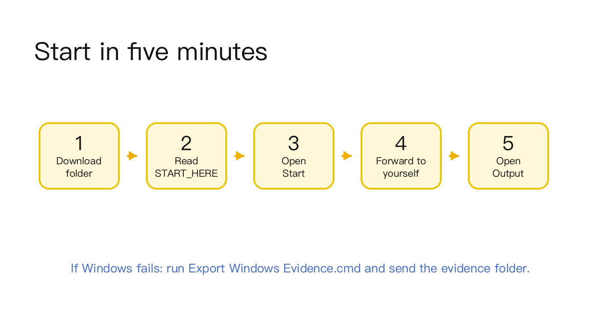

# Sherlockdogs 1.0 Public Beta

Forward to yourself. Turn WeChat self-chats into local Markdown and Codex tasks.

Generated: 2026-06-17



This release is for early testers who want a local-first clipping path from phone WeChat to desktop Markdown and Codex.

## Quick Start

1. Pick the whole beta folder for your platform.
2. Read `START_HERE.md` inside that folder.
3. Start Sherlockdogs.
4. Forward an item to yourself in WeChat.
5. Open the generated Markdown output.

## Which Folder To Use

| Platform | Folder | Status |
|---|---|---|
| macOS | [`macos/Sherlockdogs-macos-alpha-1.0.0-alpha.3`](macos/Sherlockdogs-macos-alpha-1.0.0-alpha.3/) | Real self-chat -> local WeChat DB -> Markdown/Codex path passed |
| Windows | [`windows/Sherlockdogs-windows-alpha-1.0.0-alpha.2`](windows/Sherlockdogs-windows-alpha-1.0.0-alpha.2/) | Same path is packaged; first real Windows self-chat smoke still needed |

Use the whole folder. Do not copy only the top-level launcher.

## Main Product Path

```text
Phone WeChat -> Desktop WeChat -> Local WeChat DB -> Markdown -> Codex
```

iOS Shortcut / local Inbox / sync folders are fallback paths. They are not the default public-beta story.

## Feature / Status

| Feature | Status | Notes |
|---|---|---|
| WeChat self-chat capture | Beta | User forwards to self; desktop WeChat receives locally |
| Local WeChat DB adapter | Beta | Opt-in local adapter; no hosted relay |
| Markdown archive | Ready | Writes raw content, metadata, and result folders |
| Codex handoff | Ready | `#` / `#2` can create Codex-ready tasks |
| Obsidian reading | Ready | Plain files; Obsidian is optional |
| Windows evidence export | Ready | Captures debugging material for failed real-machine smoke |

## Start Here

| Platform | Launch | Connect / test | Output | Diagnostics |
|---|---|---|---|---|
| macOS | `Sherlockdogs Start.app` | `Sherlockdogs Connect WeChat.app` | `Sherlockdogs Open Output.app` | `Sherlockdogs Doctor.app` |
| Windows | `Sherlockdogs Start.cmd` | `Sherlockdogs Connect WeChat.cmd` or `Run Windows WeChat Smoke.cmd` | `Open Sherlockdogs Output.cmd` | `Doctor Sherlockdogs.cmd` |

Each platform folder includes:

- `START_HERE.md`
- `INSTALL_GUIDE_FOR_USERS.png`
- `TROUBLESHOOTING.md`
- `PRODUCT_INTRO_AND_RISK_DISCLOSURE.md`
- `IOS_SHORTCUTS_GUIDE.md`

## Verified Evidence

| Gate | Status |
|---|---|
| macOS release gate | Passed |
| macOS WeChat self-chat path | Passed |
| Mobile entry smoke | Passed |
| Windows runtime/static package gate | Passed |
| Windows WeChat DB real-machine smoke | Pending |
| Final release check | Passed |
| Archive policy | No zip/dmg/tar generated |

## Known Limits

- This beta is for small-scope public testing, not a polished app-store install.
- First launch may take a few minutes while dependencies install.
- macOS may require right-click -> Open.
- Windows should be described as packaged and testable, not fully Mac-equivalent, until real Windows self-chat smoke passes.
- Some WeChat versions, accounts, storage layouts, or security settings may block local DB access.
- iOS Shortcut / Inbox is a fallback path, not the main public-beta story.
- Sherlockdogs does not run a hosted relay service.

## Feedback

If Windows fails, run:

```text
Export Windows Evidence.cmd
```

Send back the generated `Sherlockdogs-Windows-Evidence-*` folder. This helps separate DB discovery, key/decrypt, self-chat receive, task creation, and Codex handoff issues.

## Repository Landing Page

https://github.com/SherlockRobo/sherlockdogs
