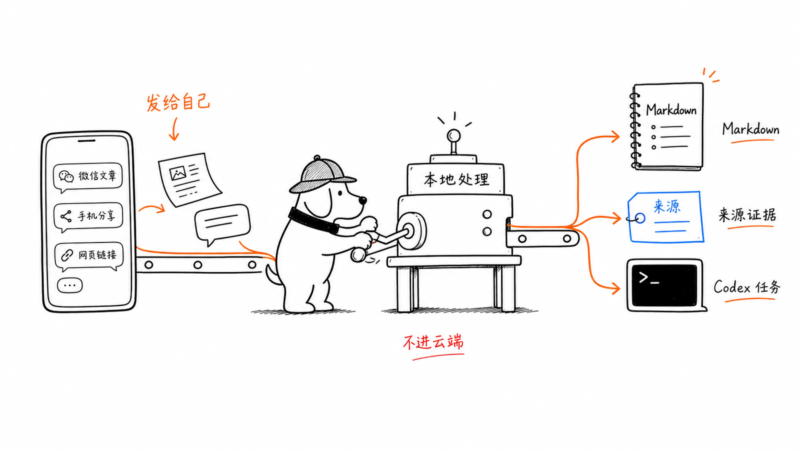
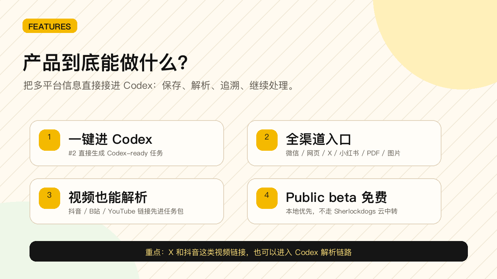
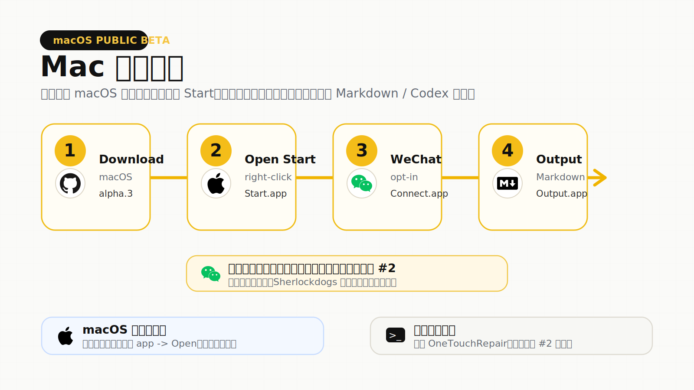
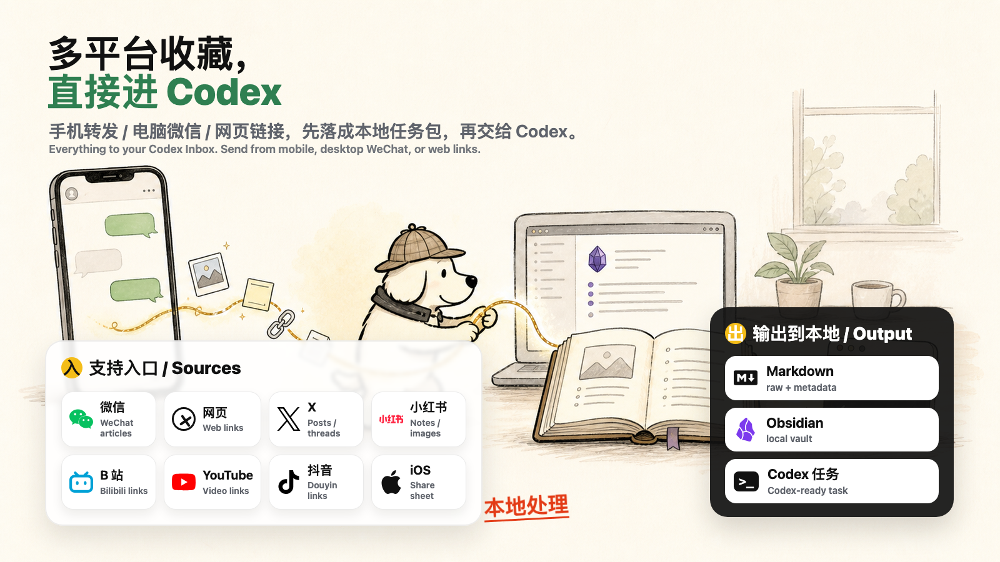

<p align="center">
  
</p>

<h1 align="center">Sherlockdogs 1.0 Public Beta</h1>

<p align="center">
  <strong>把微信、网页、X / 小红书、视频链接和手机分享，打通到 Codex 可直接处理的本地任务。</strong><br>
  <strong>Everything to your Codex Inbox.</strong>
</p>

<p align="center">
  <a href="macos/Sherlockdogs-macos-alpha-1.0.0-alpha.3/">Download for macOS</a>
  ·
  <a href="windows/Sherlockdogs-windows-alpha-1.0.0-alpha.3/">Download for Windows</a>
  ·
  <a href="../../README.md">Project Home</a>
  ·
  <a href="RELEASE_NOTES.md">Release Notes</a>
</p>

---

## What This Beta Is

Sherlockdogs is a local-first bridge from your daily information stream to your Codex Inbox.

You keep the same habit: forward useful things to yourself, or share from your phone. Sherlockdogs turns those scattered inputs into local Markdown, source evidence, attachments, and optional Codex-ready tasks.

```text
WeChat / mobile share / web links / X-XHS-video
-> Sherlockdogs
-> local Markdown + source evidence
-> Codex-ready task
```

No relay server. No bot account. No hosted inbox. The main beta path is local and opt-in.

## Product Promise



Sherlockdogs is not another bookmark folder. It is a local capture lane into Codex:

- **One touch to Codex**: `#2` creates a Codex-ready task instead of another forgotten save.
- **All channels to one workflow**: WeChat, web pages, X, Xiaohongshu, images, PDFs, and files can land in the same local pipeline.
- **Video links are first-class inputs**: Douyin, Bilibili, YouTube, and X video links can be saved with source metadata first, then handed to Codex for deeper transcript or media follow-up.
- **Free public beta**: the beta is free to try, local-first, and does not rely on a Sherlockdogs relay server.

## Download

| Platform | Best For | Download | Start Here |
|---|---|---|---|
| macOS | First beta users | [`Sherlockdogs-macos-alpha-1.0.0-alpha.3`](macos/Sherlockdogs-macos-alpha-1.0.0-alpha.3/) | [`START_HERE.md`](macos/Sherlockdogs-macos-alpha-1.0.0-alpha.3/START_HERE.md) |
| Windows | Windows beta testers | [`Sherlockdogs-windows-alpha-1.0.0-alpha.3`](windows/Sherlockdogs-windows-alpha-1.0.0-alpha.3/) | [`START_HERE.md`](windows/Sherlockdogs-windows-alpha-1.0.0-alpha.3/START_HERE.md) |

Download the whole platform folder. Do not copy only the top-level launcher.

This beta intentionally ships as folders, not as `.zip`, `.dmg`, `.tar`, or installer archives.

## Mac Install



1. Open the macOS beta folder and read `START_HERE.md`.
2. Right-click `Sherlockdogs Start.app` and choose Open if macOS blocks first launch.
3. Open `Sherlockdogs Connect WeChat.app` to connect your local desktop WeChat path.
4. Forward one simple item to yourself from mobile WeChat, ideally with `#2`.
5. Open `Sherlockdogs Open Output.app` and check the generated Markdown / Codex task.

| Platform | Start | Connect / Test | Output | Repair / Diagnose |
|---|---|---|---|---|
| macOS | `Sherlockdogs Start.app` | `Sherlockdogs Connect WeChat.app` | `Sherlockdogs Open Output.app` | `Sherlockdogs OneTouchRepair.app` / `Sherlockdogs Doctor.app` |
| Windows | `1 OneClick Install.cmd` | `2 OneClick Configure.cmd` / `Run Windows WeChat Smoke.cmd` | `Open Sherlockdogs Output.cmd` | `3 OneClick Repair.cmd` / `4 OneClick Report.cmd` |

First launch may spend a few minutes installing Python dependencies. On macOS, right-click -> Open may be required the first time.

## Supported Sources



Sherlockdogs 的核心思路很简单：不同平台的收藏和转发，最后都落到同一个本地工作流里，而不是散在一堆 App 和浏览器书签里。

Sherlockdogs has one job: turn scattered saves from different platforms into one local workflow, instead of leaving them buried across apps and bookmarks.

| 来源 / Source | 发送内容 / What To Send | 当前输出 / Current Output |
|---|---|---|
| 微信 / WeChat | 文章、自聊文本、链接、图片 / articles, self-chat text, links, images | Markdown + metadata + optional Codex task |
| 网页 / Web | 文章链接、参考页面 / article links, reference pages | `raw.md` + source URL + metadata |
| X / Twitter | 帖子、线程、链接 / posts, threads, links | local task package for later processing |
| 小红书 / Xiaohongshu | 笔记、链接、图片 / notes, links, images | local task package for later processing |
| B站 / YouTube / 抖音 | 视频链接 / video links | link-first task package, ready for transcript/media follow-up |
| iPhone 分享 / iPhone share sheet | 文本、URL、图片、PDF、文件 / text, URLs, images, PDF, files | iOS Shortcut / Inbox -> local task package |

## Why It Feels Different

| Old Habit | Sherlockdogs Path |
|---|---|
| Save a link, then forget where it went | Forward/share once, get a local task package |
| Copy title, URL, screenshots, and context by hand | Keep source, metadata, attachments, and raw content together |
| Paste scattered snippets into Codex | Hand Codex a traceable context bundle |
| Debug failures by guessing | Run Doctor / Evidence and see where the path broke |

Command tags can control processing depth:

| Tag | Behavior |
|---|---|
| no tag or `#1` | Save locally |
| `#` or `#2` | Save and create a Codex-ready task |
| `#3` | Prepare lightweight metadata / transcript analysis |
| `#4` or `#ob` | Prepare deeper reading / distillation |
| `#5` | Prepare heavier media-breakdown tasks |

## Platform Status

| Gate | Status |
|---|---|
| macOS release gate | Passed |
| macOS WeChat self-chat -> local DB -> Markdown/Codex | Passed |
| Mobile entry smoke | Passed |
| Windows package/runtime gate | Passed |
| Windows real-machine WeChat DB smoke | First beta machine passed after onboarding fixes; alpha.3 still needs fresh tester confirmation |
| Final release check | Passed |

Windows is packaged for the same product path, but should still be treated as beta because WeChat DB decrypt/key behavior can change by machine and WeChat version.

## Known Limits

- This is a public beta, not an app-store-style installer.
- Local WeChat DB access depends on WeChat version, account, storage layout, and system permissions.
- iOS Shortcut / Inbox is the fallback and direct mobile-share path when DB access is not usable.
- Sherlockdogs does not run a hosted cloud relay.
- Raw archives stay local; private app databases, credentials, and cookies are excluded from the public repository.

## Feedback

If macOS fails, run:

```text
Sherlockdogs Doctor.app
Sherlockdogs OneTouchRepair.app
```

If Windows fails, run:

```text
3 OneClick Repair.cmd
4 OneClick Report.cmd
```

`3 OneClick Repair.cmd` exports evidence, writes a Codex repair prompt, and starts a local Codex repair task when the CLI is available. If Codex is unavailable, use `4 OneClick Report.cmd` and send back the generated `Sherlockdogs-Windows-Evidence-*` folder. It helps separate DB discovery, decrypt/key setup, self-chat receive, task creation, and Codex handoff issues.

## More

- Main repository: [`SherlockRobo/sherlockdogs`](../../)
- Release notes: [`RELEASE_NOTES.md`](RELEASE_NOTES.md)
- Public beta decision: [`docs/PUBLIC_BETA_DECISION.md`](docs/PUBLIC_BETA_DECISION.md)
- Operator notes: [`docs/PUBLIC_BETA_OPERATOR.md`](docs/PUBLIC_BETA_OPERATOR.md)
